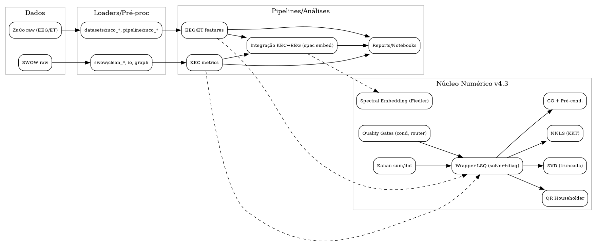

[](https://doi.org/10.5281/zenodo.16921951) [](https://doi.org/10.5281/zenodo.17053446)

# PCS Meta-Repo

[](https://github.com/agourakis82/pcs-meta-repo/actions/workflows/python-tests.yml)
[](coverage.svg)
[](https://orcid.org/0000-0002-8596-5097)
[](LICENSE)

Meta-repository for the Computational‑Symbolic Psychiatry (PCS) project.

## v4.3 Highlights

- **Agentic Design Patterns** integrados como **Quality Gate Q11** (docs/agentic_design_patterns.md).

## Architecture

High-level architecture and data/compute flows. Regenerate with `make fig-architecture` (requires Graphviz).



## EEG/RT Datasets Pipeline

This repository includes a comprehensive pipeline for processing and analyzing EEG/RT (Eye-tracking/Electroencephalography Reading Time) datasets. The pipeline implements four main steps with full quality gates and reproducibility.

### Pipeline Steps

1. **Dataset Identification**: Automatically discovers and catalogs all EEG/RT datasets
2. **Data Extraction & Preprocessing**: Extracts and preprocesses datasets for analysis
3. **Cross-validation & Quality Assessment**: Performs quality checks and validation
4. **Comparative Analysis & Reporting**: Generates comparative analysis and final reports

### Quick Pipeline Execution

```bash
# Install dependencies
pip install -r requirements.txt

# Run the complete pipeline
jupyter notebook notebooks/eeg_rt_pipeline_complete.ipynb

# Or run individual steps programmatically
python -c "
from notebooks.eeg_rt_pipeline_complete import *
# Execute steps 1-4 sequentially
"
```

### Pipeline Features

- ✅ **Fully Reproducible**: Random seeds, version control, and environment specifications
- ✅ **Quality Gates**: Automated validation at each step with comprehensive logging
- ✅ **Multi-language Support**: English documentation with support for multilingual datasets
- ✅ **Comprehensive Documentation**: Every step includes detailed comments and explanations
- ✅ **Audit Trail**: Complete logging of all operations with timestamps and checksums

### Supported Datasets

- **DERCo**: Dutch Reading Corpus (EEG + Eye-tracking)
- **GECO**: Ghent Eye-tracking Corpus (Eye-tracking)
- **OneStop**: English Reading Corpus (Eye-tracking)
- **ZuCo**: EEG during reading (EEG + Eye-tracking)
- **LPP**: Le Petit Prince (EEG + fMRI)

### Output Structure

```bash
outputs/
├── dataset_identification.json      # Step 1 results
├── processed/                       # Step 2 results
│   ├── preprocessing_report.json
│   └── [dataset]_info.json
├── validation/                      # Step 3 results
│   ├── quality_assessment_report.json
│   └── quality_assessment_plot.png
├── analysis/                        # Step 4 results
│   ├── dataset_comparison.csv
│   ├── comparative_analysis.png
│   ├── interactive_comparison.html
│   ├── final_report.json
│   └── pipeline_summary.md
└── quality_gates/                   # Quality gates results
    └── quality_gates_report.json
```

### Quality Assurance

The pipeline implements comprehensive quality gates:

- **Environment Consistency**: Python version, package versions, directory structure
- **Data Integrity**: File existence, content validation, size checks
- **Reproducibility**: Random seeds, execution logging, timestamp tracking
- **Documentation**: Complete inline documentation, README files, requirements
- **Code Quality**: Error handling, logging, docstrings, best practices

## How to cite

Please cite using the metadata in [CITATION.cff](CITATION.cff):

> Agourakis, D. PCS Meta-Repo — v4.3.3. DOI: [10.5281/zenodo.16921951](https://doi.org/10.5281/zenodo.16921951)

For additional materials see the Zenodo concept record [10.5281/zenodo.16921951](https://doi.org/10.5281/zenodo.16921951).

## Repository structure

- docs: documentation and specs
- src: source code (MIT)
- notebooks: analysis notebooks (reproducible stubs preferred)
- data/raw_public: public raw inputs (not tracked if large)
- data/processed: derived tables/graphs
- figures: generated plots and assets
- manuscripts: papers and drafts
- reports: QA artifacts (lint, linkcheck, inventory)
- tools: maintenance and QA scripts

## License

- Code: MIT — see `LICENSE`.
- Text, docs, and figures: CC BY 4.0 — see `LICENSES/CC-BY-4.0.txt`.
